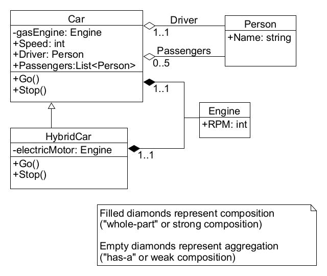

<h1>Object Oriented Programming Example</h1>

<h2>Simulation of a hybrid vehicle</h2>

### UML Diagram



### C# Code

```c#
class Car
{
    // Instance variables
    private readonly Engine gasEngine = new Engine();  // composition relationship

    // Properties
    public Person? Driver { get; set; }   // aggregation relationship
    public List<Person>? Passengers { get; set; } // aggregation relationship

    // Methods
    public int Speed
    {
        get { return gasEngine.RPM / 100; }
    }

    public virtual void Go()
    {
        gasEngine.RPM = 1000;
    }

    public virtual void Stop()
    {
        gasEngine.RPM = 0;
    }
}
```

```c#
class Engine
{
    public int RPM { get; set; }
}
```

```c#
class Person
{
    public string? Name { get; set; }
}
```

```c#
class HybridCar : Car
{
    private readonly Engine electricMotor = new();   // composition relationship

    public override void Go()
    {
        electricMotor.RPM = 1000;
        base.Go();  // sets the gas engine RPM as well
    }

    public override void Stop()
    {
        electricMotor.RPM = 0;
        base.Stop();
    }
}
```


